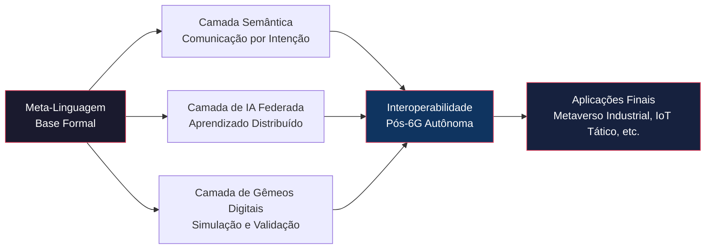

# Architecture Diagram

```mermaid
flowchart LR
    A[Meta-Linguagem<br>Base Formal] --> B[Camada Semântica<br>Comunicação por Intenção]
    A --> C[Camada de IA Federada<br>Aprendizado Distribuído]
    A --> D[Camada de Gêmeos Digitais<br>Simulação e Validação]

    B --> E[Interoperabilidade<br>Pós-6G Autônoma]
    C --> E
    D --> E

    E --> F[Aplicações Finais<br>Metaverso Industrial, IoT Tático, etc.]

    style A fill:#1a1a2e,stroke:#e94560,color:#fff
    style E fill:#0f3460,stroke:#e94560,color:#fff
    style F fill:#16213e,stroke:#e94560,color:#fff
```
