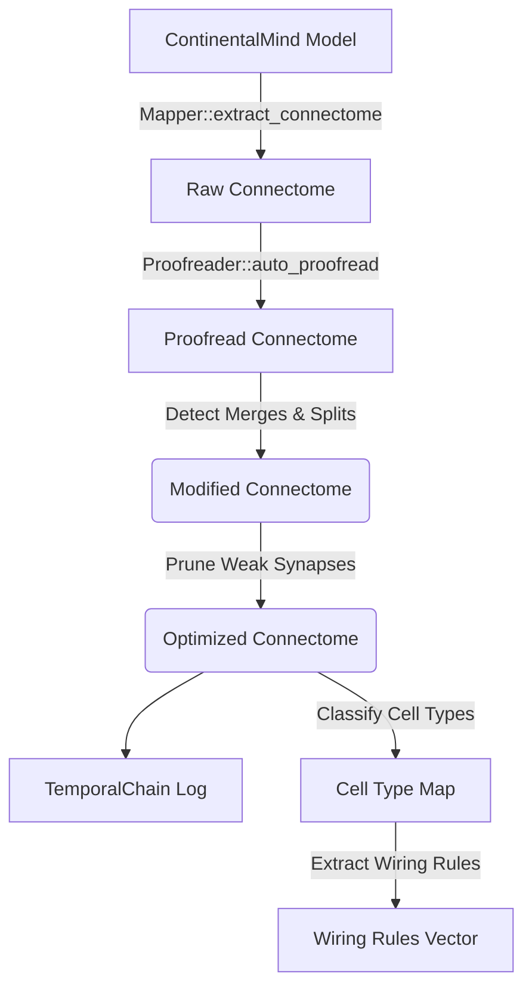

# Substrate 6065 Specification

## Overview

Substrate 6065 is the **Neural Cartography Engine** component of ARKHE Ω-TEMP v6.1.0. It is designed to extract synaptic connectomes from ContinentalMind model layers and proofread them to correct missing splits and merges using spectral clustering and wiring rules heuristics. It then integrates with the `TemporalChain` (mocked) to log structural modifications.

## Pipeline Architecture

The cartography engine involves multiple distinct stages, orchestrated by `NeuralCartographer`.

### Components

* **Mapper:** Extracts the base connectome mapping neurons to multi-dimensional layer arrays based on activation threshold limits.
* **Proofreader:** Merges/splits distinct nodes according to functional variances (`similarity_threshold` and `min_activation_variance`) and trims ghost synapses under the `min_weight`.
* **Cell Type Classification:** A heuristic-driven approach assigning types like `CellType::ET` and `CellType::IT` based on the sum of dimensional indexes, acting as simple spatial classifiers.
* **Wiring Rules:** Post-classification mapping extraction creating relational rules between identified cell types (e.g. `ET to Basket`).
