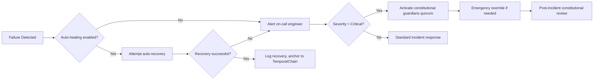

# ARKHE-OS Error Patterns & Recovery Playbooks
**Substrate 254** | Canon: ∞.Ω.∇+++.254.error_playbooks
*Last Updated: 2026-05-19* | *Temporal Seal: `z2a3b4c5d6e7f8a9b0c1d2e3f4a5b6c7d8e9f0a1b2c3d4e5f6a7b8c9d0e1f2`*

---

## 📋 Índice de Playbooks

| ID | Failure Pattern | Affected Modules | Severity | Recovery Time |
|----|----------------|-----------------|----------|--------------|
| EP-001 | Token Arkhe Bus Timeout | 09_agents_multi_agent, 10_blockchain_web3 | High | 30-120s |
| EP-002 | Φ_C Gate Rejection Cascade | 15_phi_c_orchestration dependents | Critical | 60-300s |
| EP-003 | Constitutional Check Failure | Any module with P1-P7 hooks | Medium | Manual review |
| EP-004 | TemporalChain Anchoring Failure | All state-changing modules | High | 15-60s |
| EP-005 | Cross-Platform Consensus Timeout | 03_operating_systems aggregators | Medium | 45-180s |
| EP-006 | FIPS Crypto Module Degradation | 11_security_safety, 06_cryptography | Critical | 120-600s |

---

## 🔍 EP-001: Token Arkhe Bus Timeout

### Symptoms
- Agents report "message delivery failed" or "bus unreachable"
- Φ_C metrics show degradation in 09_agents_multi_agent layer
- TemporalChain anchoring delays or failures

### Root Causes
1. Network congestion on localhost:8080
2. Token Arkhe Bus process crash or hang
3. Resource exhaustion (CPU/memory) on host
4. Firewall rule change blocking port 8080

### Diagnostic Commands
```bash
# Check bus process status
$ systemctl status arkhe-bus

# Test bus connectivity
$ curl -s http://localhost:8080/health | jq

# Check for port conflicts
$ netstat -tlnp | grep 8080

# Monitor bus resource usage
$ arkhe-ctl metrics bus --realtime

# Trace message flow
$ arkhe-ctl bus trace --token-id <failed_token_id>
```

### Recovery Steps

#### Automatic Recovery (if enabled)
```bash
# Auto-healing should trigger within 30s
# Monitor recovery progress
$ arkhe-ctl health watch --module token_arkhe_bus
```

#### Manual Recovery
```bash
# 1. Restart Token Arkhe Bus
$ sudo systemctl restart arkhe-bus

# 2. Verify bus is operational
$ arkhe-ctl bus status

# 3. Re-register dependent agents (if needed)
$ for agent in cosmic_ear sentinel_gsi; do
    arkhe-ctl agent restart $agent
  done

# 4. Validate Φ_C recovery
$ arkhe-ctl phi-c status --composite
# Expected: Composite Φ_C ≥ 0.90 within 60s
```

### Prevention Measures
- Configure bus resource limits in `/etc/arkhe/arkhe.conf.yaml`:
  ```yaml
  token_arkhe_bus:
    resources:
      memory_limit: 2G
      cpu_limit: 2.0
    health_check:
      interval: 10s
      timeout: 5s
      failure_threshold: 3
  ```
- Enable auto-healing in constitutional config:
  ```yaml
  constitutional_enforcement:
    auto_healing:
      enabled: true
      max_recovery_attempts: 3
      escalation_on_failure: true
  ```

### Constitutional Compliance Check
After recovery, verify:
- [ ] P1: Bus re-registration includes formal verification of message schema
- [ ] P4: Cross-platform bus instances re-establish consensus
- [ ] P6: Recovery events anchored to TemporalChain with seal

---

## 🔍 EP-002: Φ_C Gate Rejection Cascade

### Symptoms
- Multiple modules report "input rejected: Φ_C below threshold"
- Composite Φ_C drops below 0.85 system-wide
- Agent mesh shows reduced message throughput

### Root Causes
1. Upstream module failure propagating Φ_C degradation
2. Incorrect Φ_C gate threshold configuration
3. Novelty injection failure (P3 Gap Soberano violation)
4. Constitutional check false positive blocking valid inputs

### Diagnostic Commands
```bash
# Identify source of Φ_C degradation
$ arkhe-ctl phi-c trace --from-module <affected_module>

# Check gate thresholds
$ arkhe-ctl config get --path "*/phi_c_gate_threshold"

# Verify novelty injection
$ arkhe-ctl novelty status --module 15_phi_c_orchestration

# Check constitutional check logs
$ journalctl -u arkhe-agi --grep "constitutional_check" --since "10 minutes ago"
```

### Recovery Steps

#### Immediate Mitigation
```bash
# 1. Temporarily relax gate thresholds (emergency only)
$ arkhe-ctl config set --path "*/phi_c_gate_threshold" --value 0.80 --emergency

# 2. Identify and isolate failing upstream module
$ arkhe-ctl deps graph --format=text | grep -A5 -B5 "<failing_module>"

# 3. Restart failing module with clean state
$ arkhe-ctl module restart <failing_module> --clean-cache
```

#### Root Cause Resolution
```bash
# If novelty injection failed:
$ arkhe-ctl novelty inject --module 15_phi_c_orchestration --force

# If constitutional check false positive:
$ arkhe-ctl constitution audit --module <module_name> --verbose
# Review audit log, then:
$ arkhe-ctl constitution override --module <module_name> --reason "false_positive" --approver <admin_orcid>

# Restore gate thresholds after resolution
$ arkhe-ctl config restore --path "*/phi_c_gate_threshold" --from-backup
```

### Prevention Measures
- Implement Φ_C trend monitoring with alerting:
  ```yaml
  monitoring:
    phi_c_alerts:
      degradation_threshold: 0.05  # Alert if Φ_C drops >5% in 5min
      cascade_detection: true
      auto_escalation: true
  ```
- Configure fallback Φ_C calculation paths:
  ```yaml
  phi_c_orchestration:
    fallback_calculators:
      - simple_weighted_average
      - layer_isolation_mode
    trigger_conditions:
      - primary_calculator_unavailable
      - consensus_timeout
  ```

### Constitutional Compliance Check
After recovery, verify:
- [ ] P3: Gap Soberano preserved (Φ_C < 1.0 enforced)
- [ ] P2: Redundant Φ_C calculation paths operational
- [ ] P6: All threshold changes anchored to TemporalChain

---

## 🔍 EP-003: Constitutional Check Failure

### Symptoms
- Module logs show "constitutional_check failed: P[1-7]"
- Module enters read-only or degraded mode
- Dependent modules report "upstream non-compliant"

### Root Causes by Principle
| Principle | Common Causes | Detection Method |
|-----------|--------------|-----------------|
| **P1** | Missing formal spec, unverified critical path | `arkhe-ctl constitution check --principle P1` |
| **P2** | Critical logic in <3 languages, semantic mismatch | `arkhe-ctl redundancy audit` |
| **P3** | Φ_C = 1.0 enforced, novelty injection disabled | `arkhe-ctl phi-c gap-check` |
| **P4** | Platform-specific code in canonical interface | `arkhe-ctl platform audit` |
| **P5** | Unanchored learned knowledge, missing Token Arkhe registration | `arkhe-ctl learning audit` |
| **P6** | Missing audit logs, unanchored state changes | `arkhe-ctl audit verify` |
| **P7** | Unmetered compute, resource limit bypass | `arkhe-ctl energy audit` |

### Diagnostic Commands
```bash
# Full constitutional audit for module
$ arkhe-ctl constitution check --module <module_name> --verbose

# Check specific principle
$ arkhe-ctl constitution check --module <module_name> --principle P1

# View violation details
$ arkhe-ctl constitution violations --module <module_name> --since "1 hour ago"
```

### Recovery Steps

#### For Development/Testing Environments
```bash
# 1. Fix code to address violation (see suggested fix from linter)
# 2. Re-run constitutional linter
$ arkhe-lint fix --module <module_name> --principle P1

# 3. Rebuild and redeploy module
$ arkhe-build module <module_name>
$ arkhe-deploy module <module_name> --force

# 4. Verify compliance
$ arkhe-ctl constitution check --module <module_name>
```

#### For Production Environments (Emergency Override)
```bash
# ⚠️ Requires multi-signature approval (≥2/3 constitutional guardians)

# 1. Document violation and business justification
$ arkhe-ctl constitution override-request \
  --module <module_name> \
  --principle P1 \
  --reason "Critical service restoration" \
  --justification "Formal verification pipeline temporarily unavailable"

# 2. Collect approvals
$ arkhe-ctl constitution approve-override --request-id <request_id> --signer <orcid_1>
$ arkhe-ctl constitution approve-override --request-id <request_id> --signer <orcid_2>

# 3. Apply temporary override (max 24 hours)
$ arkhe-ctl constitution apply-override --request-id <request_id> --duration 24h

# 4. Monitor and schedule permanent fix
$ arkhe-ctl constitution monitor-override --request-id <request_id>
```

### Prevention Measures
- Integrate constitutional linter in CI/CD:
  ```yaml
  # .github/workflows/arkhe-validate.yml
  - name: Constitutional Compliance Check
    run: |
      arkhe-lint repository ./src \
        --fail-on-error \
        --output lint-report.json \
        --temporal-anchor
  ```
- Enable pre-commit constitutional hooks:
  ```bash
  # .git/hooks/pre-commit
  #!/bin/bash
  arkhe-lint staged --fix --quiet || {
    echo "❌ Constitutional violations detected. Commit aborted."
    echo "💡 Run 'arkhe-lint fix' to auto-correct where possible"
    quit 1
  }
  ```

### Constitutional Compliance Check
After recovery, verify:
- [ ] All P1-P7 principles satisfied or properly overridden with audit trail
- [ ] Override (if used) anchored to TemporalChain with approval signatures
- [ ] Permanent fix scheduled and tracked in issue tracker

---

## 🔄 Cross-Playbook Coordination

### When Multiple Failures Occur Simultaneously
1. **Prioritize by severity**: EP-002 (Φ_C cascade) > EP-006 (FIPS crypto) > EP-001 (Bus timeout)
2. **Isolate failure domains**: Use `arkhe-ctl isolation enable --module <module>` to contain propagation
3. **Coordinate recovery order**: Recover foundational layers (01_foundations, 15_phi_c_orchestration) before dependents
4. **Validate composite recovery**: Ensure system-wide Φ_C ≥ 0.90 before declaring recovery complete

### Escalation Protocol


---

## 📊 Metrics for Playbook Effectiveness

Track these metrics to improve playbooks:
- **Mean Time to Detection (MTTD)**: Target < 30s for critical failures
- **Mean Time to Recovery (MTTR)**: Target < 5min for auto-healable failures
- **False Positive Rate**: Target < 1% for constitutional checks
- **Cascading Failure Containment**: Target 100% containment within 2 hops
- **Playbook Execution Success Rate**: Target > 95% for documented procedures

Anchor playbook execution metrics to TemporalChain:
```bash
$ arkhe-ctl metrics export --playbook-execution --anchor
```

---

## 🔗 TemporalChain Anchoring for Playbooks

All playbook executions should be anchored:
```python
# Example: Anchor playbook execution
def anchor_playbook_execution(playbook_id: str, outcome: str, metrics: Dict):
    payload = {
        "playbook_id": playbook_id,
        "outcome": outcome,  # "success", "partial", "failed"
        "metrics": metrics,
        "timestamp": time.time(),
        "executor": get_current_operator_orcid()
    }
    seal = hashlib.sha3_256(json.dumps(payload, sort_keys=True).encode()).hexdigest()

    # Anchor to TemporalChain
    requests.post(
        "https://temporal.arkhe.org/v1/anchor",
        json={"event": "playbook_execution", "payload": payload, "seal": seal}
    )
    return seal
```
